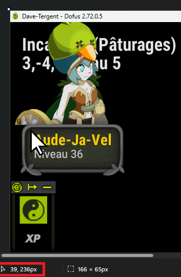

# Windofman

A little tool for ordering and switch between multiple dofus window on Windows

Original repo is [Rs-Appez](https://github.com/Rs-appez/windofman)

I added the auto switch of character in fight, inspired by [MultiXasa](https://github.com/PatrickJAMET/MultiXasa/)

## Initialization

Setup the virtual environement

```
$ ./init_venv_windofman.bat
```

## Start windofman

You have to do the venv init first

```
$ ./launch.bat
```

## Usage

### Interface


- Set the initative of your characters

- You can clic on your  charactere name to directly active the window

### Shortcut

- Press **F2** to switch to the next character

- Press **F3** to switch to the previous character


## Finder setup

### Dofus setup

Finder is the feature that allows you to automatically switch windows while in fight. Setup is easy : 
 * Enable the "Show illustration at start of turn" / "Afficher l'illustration au début du tour" 
 
 * Your Dofus windows must be in a precise spot everytime, i recommend you go full screen on a given screen everytime

### config.json setup
In `config.json` file, you need to precise the zone where the "start turn illustration" will be. It should work with the whole screen but take longer. You can use paint as so to do it :
  * Take screenshot of whole screen at the start of the turn, with the "start turn illustration" notification showing
  
  * Copy screenshot in Paint. 
  * Place your cursor where the name of the character turn is displayed. It should give you pixel position atthe bottom left of the paint window. This is your x and y, x=39 and y=236 here

  
  * Use the selection tool to make a rectangle around the character name. Make a big enough rectangle tosurround all possible char name text, but not to big to be efficient. This is your width and height,width=176 and height=39 here

     
  * Report this values in config.json, in front of x / y / width / height

### Screenshot creation

You then need to place screenshots for the software to search in `finder` folder. Expected screenshots are small part of the name of the character, that is unique. Don't screen shot the first part of the character name if you're using the same for every character (Toto-Panda, Toto-Iop, ...)

Back to paint, you need for each character : 
 * Screenshot the "start turn illustration" notification, put it in Paint
 * Select a small *UNIQUE* part of your character name

     
 * Press the "crop" button in paint with the selection active 
       
  * Save the image as a .png using the whole character name (Toto-Panda.png for instance)

  * Repeat for each character

### Conclusion 

The software should now automatically switch to the character window at the start of the turn, it can take some time but should not get over 1 second. You can disable the functionnality using the GUI when you're not in combat if you want, or let it run if it's not too heavy on your PC